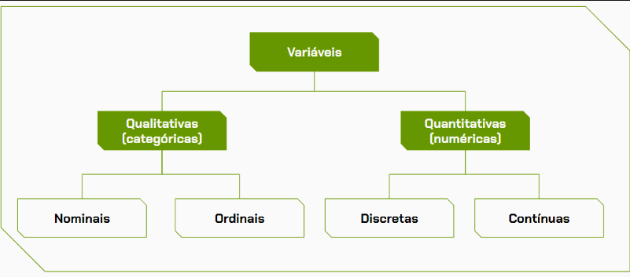

# Sobre Variáveis

Variáveis são características, atributos ou quantidades de uma amostra ou população que podem ser mensuradas, contadas ou categorizadas. Elas são fundamentais para descrever e entender os fenômenos em estudo. As variáveis podem ser classificadas basicamente em dois tipos: qualitativas (ou categóricas) e quantitativas (ou numéricas).

## Variáveis Qualitativas

Também conhecidas como categóricas, representam características que não podem ser medidas numericamente, mas podem ser categorizadas, ou seja, representam uma classificação. Estas variáveis podem ser nominais ou ordinais.

Observação: a depender dos tipos dos dados, é possível que uma variável qualitativa possa ser representada por números. Por exemplo, uma coluna que representa uma característica em que 0 simboliza “Não” e 1 simboliza “Sim”. Os números aqui servem para resumir a representação dos dados e não devem ser utilizados para cálculo, por exemplo, de média.

- Nominal: Uma variável qualitativa nominal é aquela que classifica os elementos em classes ou categorias em relação ao tipo do dado representado. Ela não possui uma relação de grandeza ou ordem dos dados

Exemplos: Nome de produtos, departamentos, métodos de pagamento ou variáveis geográficas, como, cidade, estado e região.

- Ordinal: Uma variável qualitativa ordinal também é aquela que classifica os elementos em classes ou categorias, porém existe uma ordem natural ou hierárquica entre as categorias.

Exemplos: grau de escolaridade (ensino infantil, ensino fundamental, ensino médio), nível de satisfação do cliente (insatisfeito, neutro e satisfeito) e nível socioeconômico.

## Variáveis Quantitativas

Representam medidas numéricas ou quantidades observáveis que podem ser expressas em números. Elas são resultantes de contagens (conjunto finito de valores) ou mensurações (conjunto infinito de valores). Estas variáveis podem ser discretas ou contínuas.

- Discreta: Uma variável quantitativa discreta é aquela que apresenta valores que podem ser contados e geralmente inteiros. 

Exemplos: quantidade de produto vendido, número de cômodos em uma casa e idade.

- Contínua: 

Uma variável quantitativa contínua é aquela que apresenta valores que podem assumir qualquer valor dentro de um intervalo específico e geralmente são expressos como números reais.

Exemplos: peso de um produto, altura de uma pessoa, tempo e temperatura de um experimento.